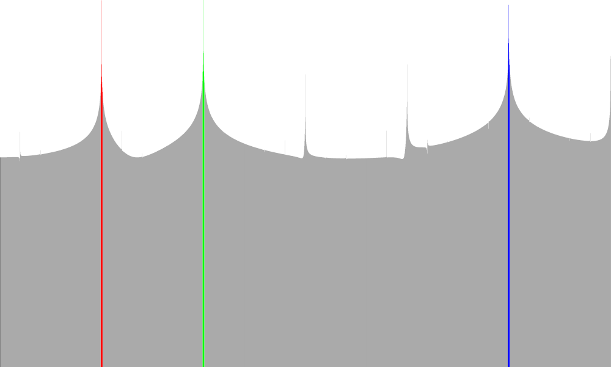
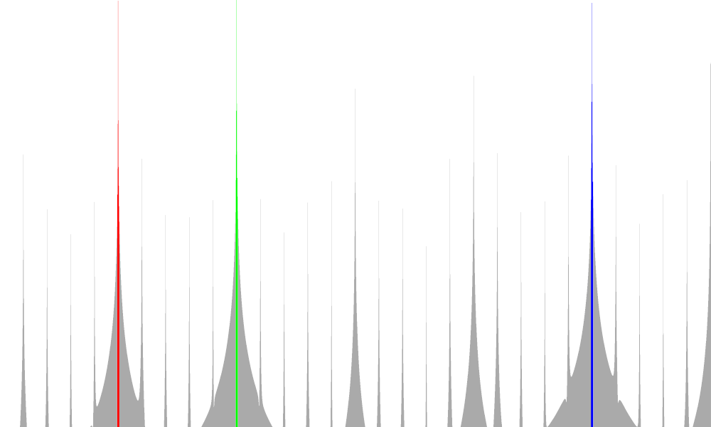
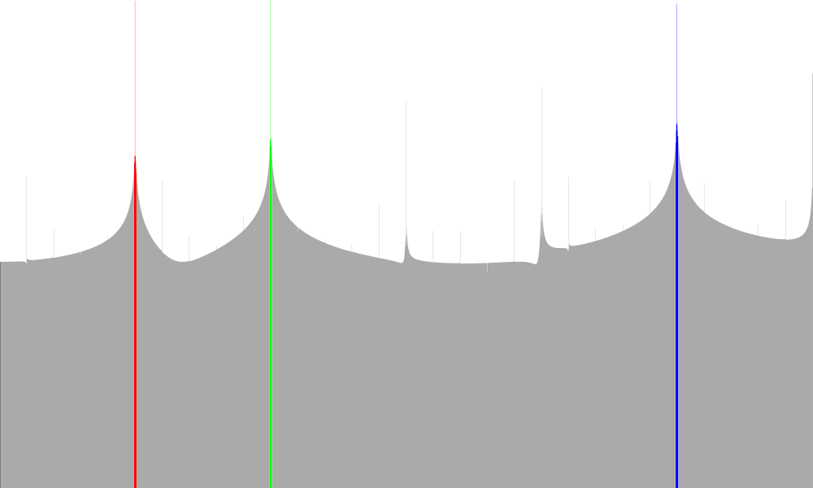

# Rust: library for frequency spectrum analysis using FFT
A `no_std` Rust library to filter out the frequencies of a digital signal (e.g. audio) using FFT. The main goal of this 
crate is to be educational to the world and myself. This is not a bullet-proof or ideal solution! It tries to show in 
Rust code how to get frequencies from a signal as simple as possible (many code comments etc). Feel free to contribute,
improve, and point out possible errors/bugs/wrong assumptions.

**I'm not an expert on digital signal processing. Code contributions are highly welcome! :)**

If you need DSP (digital signal processing) this crate may be useful for you too: https://crates.io/crates/dsp


## How to use
```rust
use spectrum_analyzer::{hann_window, samples_fft_to_spectrum};

fn main() {
    // This lib also works in `no_std` environments!
    let samples = get_samples(); // TODO implement
    // apply hann window for smoothing; length must be a power of 2 for the FFT
    let hann_window = hann_window(&samples[0..4096]);
    // calc spectrum
    let spectrum = samples_fft_to_spectrum(
        &hann_window,
        44100,
        Some(&|x| 20.0 * x.log10()),
        None,
    );
    // print out Hz => magnitude mapping (in log scale)
    for (fr, vol) in spectrum.iter() {
        println!("{}Hz => {}", fr, vol);
    }
}
```

## Examples Output: Input is a sample with a beat from a song
```
21Hz => 133.63696740490568
...
43Hz => 141.81170212599122
88Hz => 130.9031874924785

// all other values above 100 Hz are smaller
// values are in logarithmic scale; see scale function above
```

## Example visualization
In the following example you can see a basic visualization of frequencies 0 to 3000 for 
a layered signal of sine waves at 500, 1000, and 2500 hz. The peaks are colored respectively.

### No window function on samples before FFT
Much noise.


### Hann window function on samples before FFT
Less overall noise but noisy peaks.


### Hamming window function on samples before FFT
Better SNR compared to no window.


