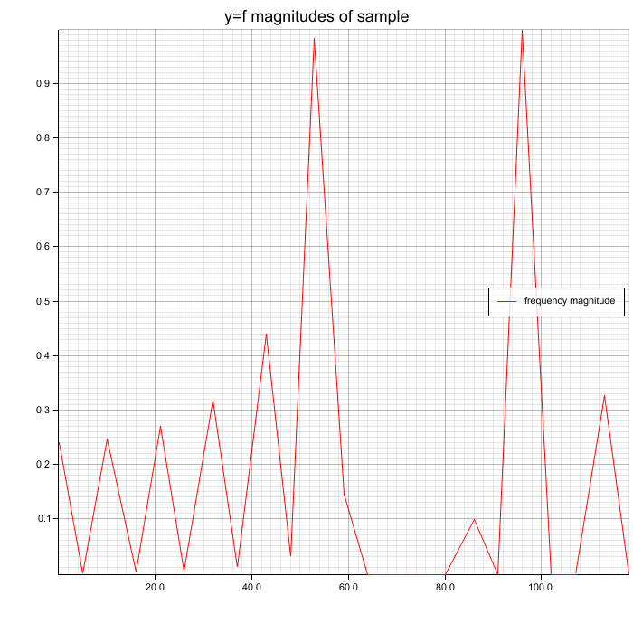
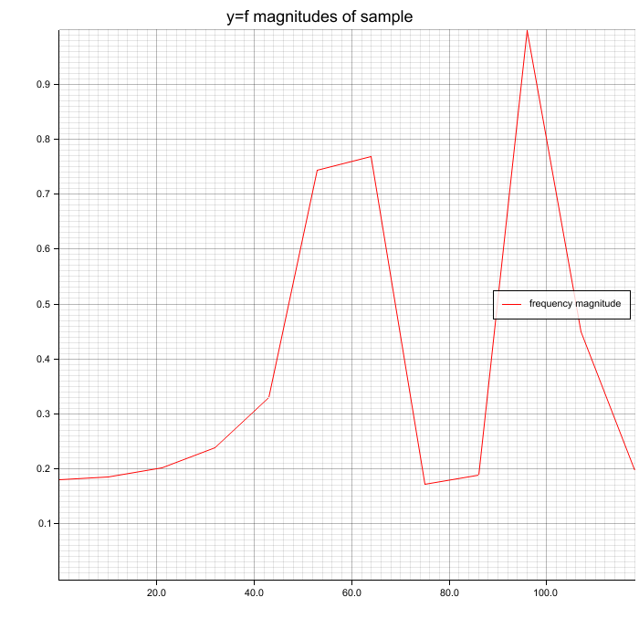

# Rust: library for frequency spectrum analysis using FFT
A simple and fast `no_std` library to get the frequency spectrum of a digital signal (e.g. audio) using FFT.
It follows the KISS principle and consists of simple building blocks/optional features. In short, this is 
a convenient wrapper around several FFT implementations which you can choose from during compilation time
via Cargo features.

**I'm not an expert on digital signal processing. Code contributions are highly welcome! 🙂**

**The MSRV (minimum supported Rust version) is 1.51 Stable because this crate needs the 
"resolver" feature of Cargo to cope with build problems occurring in `microfft`-crate.**

## I want to understand how FFT can be used to get a spectrum
Please see file [/EDUCATIONAL.md](/EDUCATIONAL.md).

## How to use (including `no_std`-environments)
Most tips and comments are located inside the code, so please check out the repository on
Github! Anyway, the most basic usage looks like this:

### FFT implementation as compile time configuration via Cargo features
This crate offers multiple FFT implementations using the crates `rustfft` and `microfft` - both are great, shout-out to 
the original creators and all contributors! `spectrum-analyzer` offers three features, where exactly one feature
is allowed to be activated, otherwise the build breaks! To see differences between the implementations, plot the results
or look into the screenshots of this README.

- `rustfft-complex` **default**, **std (recommended)**: for regular applications, most accurate and most performance
- `microfft-complex` **no_std (recommended)**: more accurate than `microfft-real`
- `microfft-real` **no_std**, less accurate but faster than `microfft-complex`

### Cargo.toml
```toml
# ONLY NEEDED FOR `no_std`-builds!
# fixes `no_std` build problems caused by wrong feature resolution of Cargo
# This works since Rust 1.51 (stable)
resolver = "2"

# by default feature "rustfft-complex" is used
spectrum-analyzer = "<latest>"
# or for no_std/microcontrollers
spectrum-analyzer = { version = "<latest>", default-features = false, features = "microfft-complex" }
# or
spectrum-analyzer = { version = "<latest>", default-features = false, features = "microfft-real" }
```

### your_binary.rs
```rust
use spectrum_analyzer::{samples_fft_to_spectrum, FrequencyLimit};
use spectrum_analyzer::windows::hann_window;

fn main() {
    // This lib also works in `no_std` environments!
    let samples: &[f32] = get_samples(); // TODO you need to implement the samples source
    // apply hann window for smoothing; length must be a power of 2 for the FFT
    let hann_window = hann_window(&samples[0..4096]);
    // calc spectrum
    let spectrum_hann_window = samples_fft_to_spectrum(
        // (windowed) samples
        &hann_window,
        // sampling rate
        44100,
        // optional frequency limit: e.g. only interested in frequencies 50 <= f <= 150?
        FrequencyLimit::All,
        // optional per element scaling function, e.g. `20 * log10(x)`; see doc comments
        None,
        // optional total scaling at the end; see doc comments
        None,
    );

    for (fr, fr_val) in spectrum_hann_window.data().iter() {
        println!("{}Hz => {}", fr, fr_val)
    }
}
```

## Scaling the frequency values/amplitudes
As already mentioned, there are lots of comments in the code. Short story is:
Type `ComplexSpectrumScalingFunction` can do anything like `BasicSpectrumScalingFunction` whereas `BasicSpectrumScalingFunction`
is easier to write, especially for Rust beginners.

## Performance
*Measurements taken on i7-8650U @ 3 Ghz (Single-Core) with optimized build and using `rustfft` as FFT implementation*


| Operation                                     | Time   |
| --------------------------------------------- | ------:|
| Hann Window with 4096 samples                 | ≈70µs  |
| Hamming Window with 4096 samples              | ≈10µs  |
| Hann Window with 16384 samples                | ≈175µs |
| Hamming Window with 16384 samples             | ≈44µs  |
| FFT to spectrum with 4096 samples @ 44100Hz   | ≈240µs |
| FFT to spectrum with 16384 samples @ 44100Hz  | ≈740µs |

## Example visualization
In the following example you can see a basic visualization of frequencies `0 to 4000Hz` for 
a layered signal of sine waves of `50`, `1000`, and `3777Hz` @ `41000Hz` sampling rate. The peaks for the 
given frequencies are clearly visible. Each calculation was done with `2048` samples, i.e. ≈46ms.

**The noise (wrong peaks) also comes from clipping of the added sine waves!**

### Spectrum without window function on samples
Peaks (50, 1000, 3777 Hz) are clearly visible but also some noise.
 are clearly visible but also some noise.")

### Hann window function on samples before FFT
Peaks (50, 1000, 3777 Hz) are clearly visible and Hann window reduces noise a little bit. Because this example has few noise, you don't see much difference.
 are clearly visible and Hann window reduces noise a little bit. Because this example has few noise, you don't see much difference.")

### Hamming window function on samples before FFT
Peaks (50, 1000, 3777 Hz) are clearly visible and Hamming window reduces noise a little bit. Because this example has few noise, you don't see much difference.
 are clearly visible and Hamming window reduces noise a little bit. Because this example has few noise, you don't see much difference.")

## Trivia / FAQ
### Why f64 and no f32?
I tested f64 but the additional accuracy doesn't pay out the ~40% calculation overhead (on x86_64).
### What can I do against the noise?
Apply a window function, like Hann window or Hamming window. But I'm not an expert on this.

## Good resources with more information
- Interpreting FFT Results: https://www.gaussianwaves.com/2015/11/interpreting-fft-results-complex-dft-frequency-bins-and-fftshift/
- FFT basic concepts: https://www.youtube.com/watch?v=z7X6jgFnB6Y
- „The Fundamentals of FFT-Based Signal Analysis and Measurement“ https://www.sjsu.edu/people/burford.furman/docs/me120/FFT_tutorial_NI.pdf
- Fast Fourier Transforms (FFTs) and Windowing: https://www.youtube.com/watch?v=dCeHOf4cJE0

Also check out my blog post! https://phip1611.de/2021/03/programmierung-und-skripte/frequency-spectrum-analysis-with-fft-in-rust/

### Real vs Complex FFT: Accuracy
The FFT implementations have different advantages and your decision for one of 
them is a tradeoff between accuracy and computation time. The following two 
screenshots (60 and 100 Hz sine waves) visualize a spectrum obtained by real FFT 
respectively complex FFT. The complex FFT result is much smoother and more accurate 
as you can clearly see.

⚠ Because of a frequency resolution of ~10Hz in this example (4096 samples, 44100Hz sampling rate), the peaks are not exactly at 60/100 Hz. ⚠

#### Real FFT (less accuracy)

#### Complex FFT (more accuracy)


